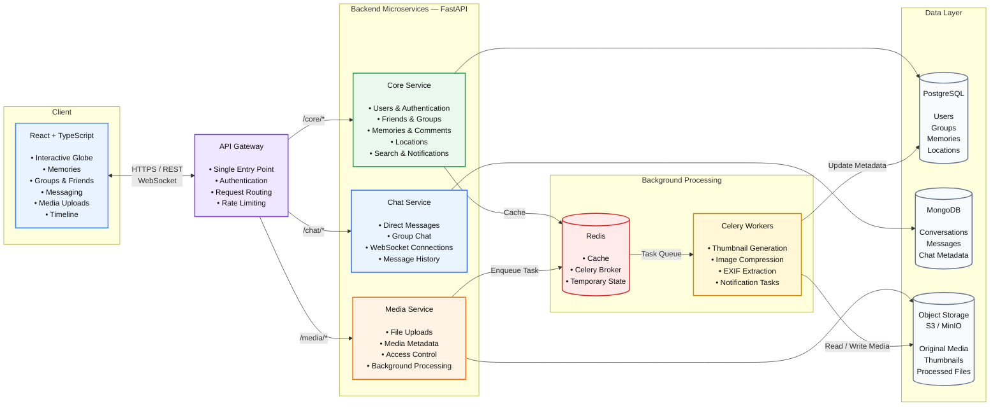

# mémoire — architecture

## Main Flow

- **React + TypeScript** communicates with the backend through the **API Gateway**.
- The gateway routes requests to the appropriate **FastAPI microservice**.
- **Core Service** owns the main social and memory domain and uses **PostgreSQL**.
- **Chat Service** handles real-time messaging and uses **MongoDB**.
- **Media Service** handles uploaded media and stores files in **S3 / MinIO**.
- **Redis** provides shared infrastructure such as caching and acts as the **Celery broker**.
- **Celery workers** execute expensive asynchronous jobs such as thumbnail generation, image compression, EXIF extraction, and notification processing.
